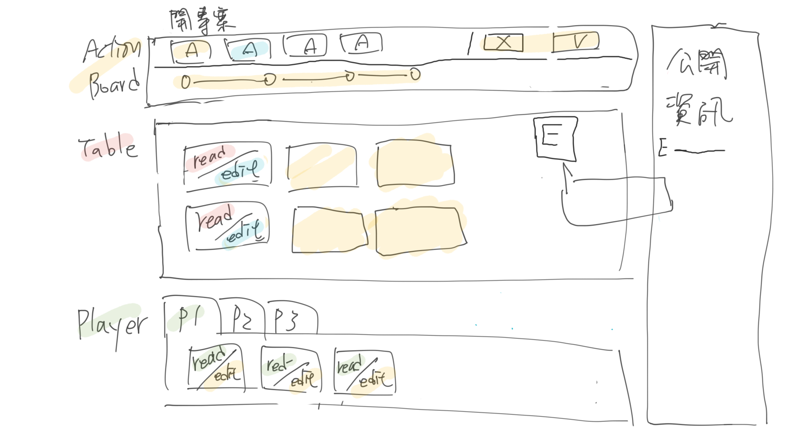

# Roadmap

This is the living document capture the current area of focus, and what needs to be done before we are ready to online.

* Areas that need help are marked with *[help needed]*.
* Stuff that team is working on is marked with *[T]*.

## First release

### Host Open Star Ter Village

* [x] serve client build
* [x] refactor build folder under webapp/build
  * [x] copy client build
  * [x] copy server build and host both client pages and api requests
* [x] deploy to heroku
* [x] user can see the "click-to-deploy" button on the readme file when landed in the project
  * [x] user can see the "click-to-deploy" button on the readme file with comprehensive information of the webapp project
  * [x] As a developer, I would like to understand how the heroku works with Open Star Ter Village webapp project

#### implementation

* [x] heroku single application deployment

#### End A Game

* [ ] Assume first player is Game Master who can end the current game *[T]*
* [x] Replace Local game with Server game

### Basic game logics

* [x] Victory points
* [x] Action points
* [x] Action can be executed only once (mirrored action can bypass it)
* [ ] Player closed project may score extra victory points
* [ ] Migrate settle phase into action stage. Projects are immediately closed when they reach the requirements. Then Remove Settle phase.
* [ ] Activate and deactivate Event cards
* [ ] End game

#### Action Stage

* [x] Play Project cards
  * [x] Basic play function
  * [x] Fill in jobs
  * [x] Play Job card with Project card (validate, check eligible included)
  * [x] Reduce player action point (validate, check eligible included)
  * [x] Reduce player worker token (validate, check eligible included)
  * [ ] Player play project card may score victory points
* [x] Play Job cards
  * [x] basic play function
  * [x] Play Job card on an Active project (includes validation and eligibility check)
  * [x] Deduct player action point (includes validation and eligibility check)
  * [x] Deduct player worker token (includes validation and eligibility check)
  * [ ] Recruit two ppl once (in the basic rule)
* [x] contribute owned projects
  * [x] basic play function
  * [ ] Contribute Owned projects value adjustment
* [x] contribute joined projects
  * [x] basic play function
  * [ ] Contribute Joined projects value adjustment
* [x] Remove and refill job cards
* [ ] Mirror

Move interfaces:

```ts
function createProject(G: G, ctx: ctx, projectCardIndex: number, jobCardIndex: number): void

function recruit(G: G, ctx: ctx, jobCardIndex: number, activeProjectIndex: number): void

function contributeOwnedProjects(G: G, ctx: ctx, contributions: { activeProjectIndex: number; jobName: JobName; value: number }[]): void

function contributeOtherProjects(G: G, ctx: ctx, contributions: { activeProjectIndex: number; jobName: JobName; value: number }[]): void

function refillJobremoveAndRefillJobs(G: G, ctx: ctx, jobCardIndices: number[]): void

function mirror(G: G, ctx: ctx, actionName: string, ...params: any[]): void
```

#### Settle Stage

> TODO: migrate into action stage. Projects closed immediately when fulfilled the requirements

* [x] Close projects

#### Discard Stage

* [ ] Discard project cards

Move interfaces:

```ts
function discardProjectCards(G: G, ctx: ctx, projectIndices: number[]): void
```

#### Refill Stage

* [x] Refill and End
  * [x] Refill project cards
  * [x] Refill action points

Move interface:

```ts
// inner function
function refillProject(): void {}

// exposed function
function refillAndEnd(G: G, ctx: ctx): void
```

#### Unit tests

* [ ] Find a proper game-flows and integration tests btw different game states *[T]*
  * [ ] Survey boardgame.io unit tests use cases
  * [ ] Find solution and proposal

#### User Interface / User Experience



* [x] Design UI flow scratch
  * references as follows
  * [stone age](https://boardgamearena.com/gamepanel?game=stoneage)
  * [pandemic](https://boardgamearena.com/gamepanel?game=pandemic)
  * [agricola](https://boardgamearena.com/gamepanel?game=agricola)
* [x] Decide Styling tools

  Note: Principle component guildline is fully decouple the styling component with layout components.
  eg. ProjectCard (layout logic) depends on Card (Component with styles)

  * Tailwind: We would love to try new things (Fancier :rocket:)
  * Styled component: We would love to try new things (Classic :tada:)
  * SASS: Old school
  * ~~Material UI~~
  * ~~Boostrap~~

  Highly customised is our two project directions so Material UI and Bootstrap are not fit in our roadmap
* [x] Design client folder structure
  1. feature + style
  * src/
    * features/
      * ResourceCard/
        * ?styled.jsx
      * ProjectCard
      * EventCard
    * styled/
      * CardVertical
      * CardHorizontal
      * ?ResourceCard.styled.jsx

  2. feature
  * src/
    * features/
      * ResourceCard/
        * ResourceCard.jsx
        * ResourceCard.styled.jsx
      * ProjectCard/
        * ProjectCard.jsx
        * ProjectCard.styled.jsx
      * EventCard/

  Folders should be structured by features (scenario 2) but it is viable to have common styled components such as Button, Tab, or Input collected in the common folder (styled foder in scenario 1).
* [x] Header
* [x] Table
  * [x] Table Layout
  * [x] Projct Card (read)
* [ ] Play Project cards *[T]*
* [ ] Play Job cards
* [ ] Contribute the projects

### Apply New Rules

* [x] Decouple Job and Force cards in Player Hand
* [x] Split Job and Force cards deck

```ts
// inner function
function refillProject(): void {}
function refillJob(): void {}
function refillForce(): void {}
```

* [x] Move Job cards from Player Hand to Table
* [x] Refactor project cards
* [x] Add victory points
* [x] Refactor worker token on project card
* [x] Remove goal cards
* [x] Remove force cards from main game

### Advanced game logics

* [ ] Apply Basic Rule and Advanced Rule
* [ ] Build Open Star Tree

#### Action Stage

* [ ] Growth Open Star Tree

### Expansions

#### Core Logic

* [ ] Build Force cards

#### Action Stage

* [ ] Play Force cards

#### Discard Stage

* [ ] Discard force cards

#### Refill Stage

* [x] Refill force cards

```ts
function discardForceCards(G: G, ctx: ctx, forceIndices: number[]): void
// inner function
function refillForce(): void {}
```
